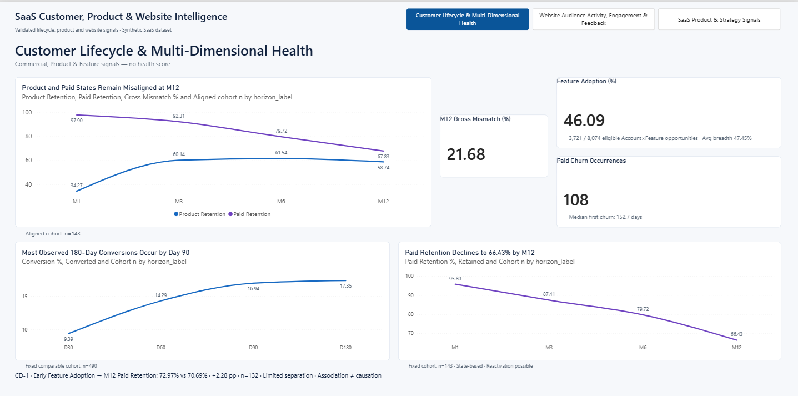
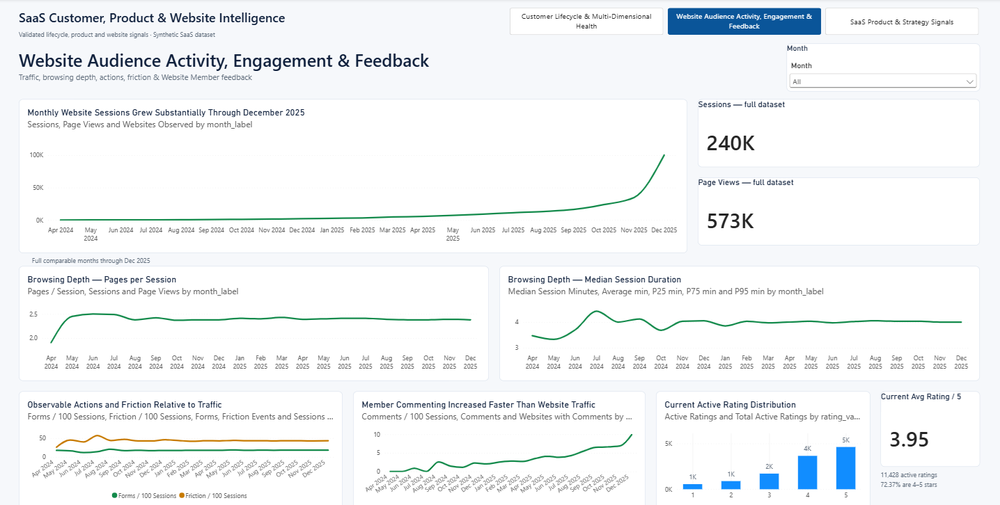
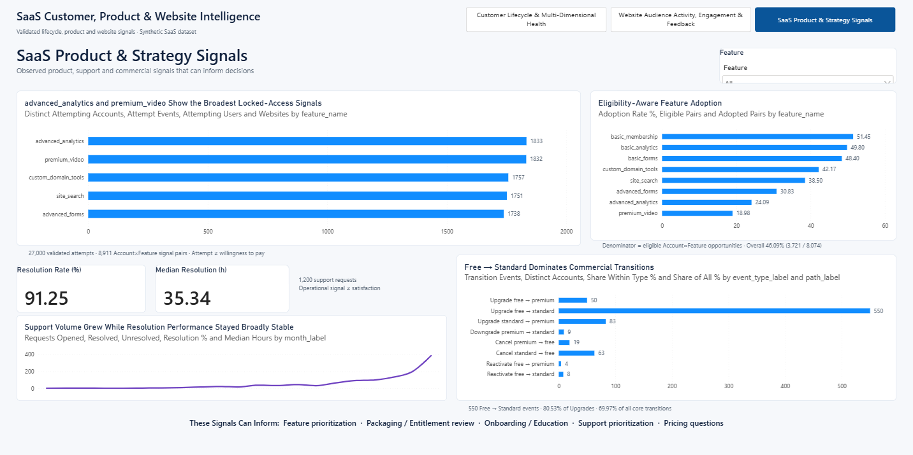

# Power BI Dashboard

This directory contains the Power BI reporting layer for the Website Builder SaaS data-platform project.

The dashboard is stored as a Power BI Project (`.pbip`), allowing the report definition and semantic model to be version-controlled as text-based project files.

## Dashboard Pages

The report contains three analytical pages:

### 1. Customer Lifecycle & Multi-Dimensional Health

Focuses on the customer lifecycle and the relationship between product behavior and commercial status.

Key areas include:

- Activation and paid conversion
- Paid retention
- Product activity versus paid status
- Feature adoption
- Lifecycle and churn-related signals

### 2. Website Audience Activity, Engagement & Feedback

Focuses on how published websites perform from the perspective of visitors, members, and engagement.

Key areas include:

- Website sessions and page views
- Audience activity and engagement
- Form submissions
- Friction signals
- Ratings and feedback
- Support-related activity

### 3. SaaS Product & Strategy Signals

Focuses on product usage patterns and strategic SaaS signals.

Key areas include:

- Feature adoption
- Locked-feature demand
- Commercial transitions
- Product usage signals
- Monetization-related signals

## Dashboard Preview

### Customer Lifecycle & Multi-Dimensional Health



### Website Audience Activity, Engagement & Feedback



### SaaS Product & Strategy Signals



## Power BI Project Structure

The canonical Power BI project is stored under:

```text
dashboard/powerbi/
├── SaaS_Analytics_Dashboard.pbip
├── SaaS_Analytics_Dashboard.Report/
└── SaaS_Analytics_Dashboard.SemanticModel/
```

The `.pbip` project contains both the report definition and the semantic model used by the dashboard.

Local Power BI cache and machine-specific configuration files are excluded from version control through the repository `.gitignore`.

## Data Source

The semantic model was developed against a local PostgreSQL database running on:

```text
localhost:5432
```

The historical development database name was:

```text
saas_website_builder_9h
```

This database name represents the original local development environment and is not a required database name for reproducing the project.

The Power BI model consumes curated views from the PostgreSQL `dashboard` schema rather than querying the operational tables directly.

## Serving-Layer Mapping

The semantic model connects to the following PostgreSQL serving views:

| Power BI Table | PostgreSQL View |
|---|---|
| Commercial Transitions | `dashboard.vw_commercial_transition` |
| Conversion | `dashboard.vw_conversion_horizon` |
| Feature Adoption | `dashboard.vw_feature_adoption` |
| Feature | `dashboard.vw_feature` |
| Lifecycle KPIs | `dashboard.vw_lifecycle_kpis` |
| Locked Feature Signal | `dashboard.vw_locked_feature_signal` |
| Paid Retention | `dashboard.vw_paid_retention_horizon` |
| Product vs Paid | `dashboard.vw_product_paid_aligned` |
| Rating Snapshot | `dashboard.vw_rating_snapshot` |
| Support Monthly | `dashboard.vw_support_monthly` |
| Support Summary | `dashboard.vw_support_summary` |
| Website Monthly | `dashboard.vw_website_monthly` |

The SQL definitions for these serving views are version-controlled in:

[`../sql/40_serving/001_dashboard_views.sql`](../sql/40_serving/001_dashboard_views.sql)

The semantic model also contains Power BI-managed date tables used for time-based analysis.

## Reporting Architecture

The reporting flow is:

```text
PostgreSQL Operational Data
          │
          ▼
Dashboard Serving Views
   (dashboard schema)
          │
          ▼
Power BI Semantic Model
          │
          ▼
Power BI Report
          │
          ▼
Three Analytical Dashboard Pages
```

This keeps the reporting layer connected to explicit SQL serving contracts rather than embedding the entire analytical preparation process inside Power BI.

## Reproducing the Dashboard

To reproduce the reporting layer:

1. Build and populate the PostgreSQL project database.
2. Create the `dashboard` serving views using `sql/40_serving/001_dashboard_views.sql`.
3. Open `dashboard/powerbi/SaaS_Analytics_Dashboard.pbip` in Power BI Desktop.
4. Update the PostgreSQL connection if your local server or database name differs from the historical development environment.
5. Refresh the semantic model.

The exact synthetic input package used by the canonical project is available through the project's Frozen Data Release v1.0.

See [`../data/README.md`](../data/README.md) for data-release and reproduction details.

## Version-Control Notes

The repository contains the text-based Power BI Project representation rather than relying only on a binary `.pbix` file.

This allows important dashboard artifacts to be inspected and version-controlled, including:

- Report definitions
- Page definitions
- Visual definitions
- Semantic-model definitions
- Relationships
- Table definitions
- Measures and model metadata

Machine-specific Power BI files are intentionally excluded.

Examples include:

```text
**/.pbi/localSettings.json
**/.pbi/cache.abf
**/.pbi/unappliedChanges.json
```

## Design Principle

The dashboard is intentionally separated from the operational schema.

PostgreSQL owns the canonical analytical preparation and serving contracts, while Power BI acts as the semantic and presentation layer.

This separation keeps business logic traceable, reduces duplicated transformation logic inside the BI tool, and makes the reporting layer easier to validate against the underlying SQL serving layer.