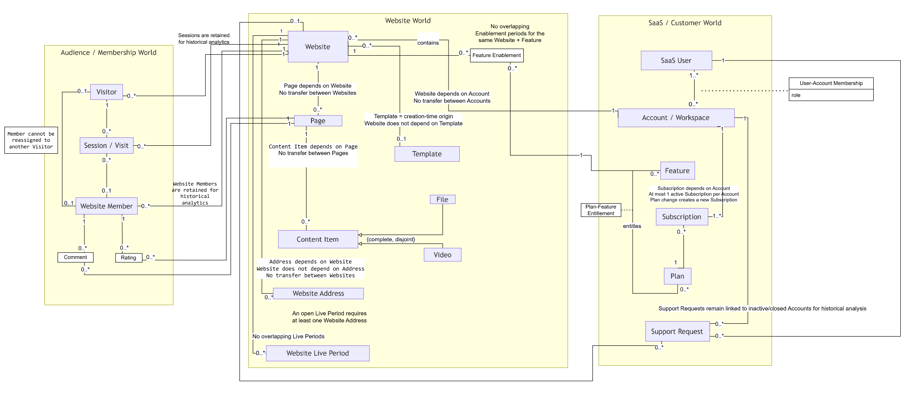

# Schema Reference

This document provides a structured reference for the data model used by the SaaS Website Builder Data Platform.

It is intended as a technical lookup document rather than a narrative explanation of the project.

The model can be understood through three layers:

```text
Business / Conceptual Model
            ↓
Logical Relational Model
            ↓
Physical PostgreSQL Schema
```

## Entity Relationship Diagram

The diagram below provides a high-level view of the project's core business domains, entities, and relationships.

It represents the conceptual and domain-level data model and should not be interpreted as the complete physical PostgreSQL schema.



These layers are related, but they are not interchangeable.

The canonical PostgreSQL schema has been selected, executed, and verified. Exact physical definitions are maintained in the version-controlled DDL under `sql/10_schema/`.

---

# 1. Reference Scope

This document currently covers:

- major business domains
- core entities
- entity responsibilities
- ownership relationships
- important identity distinctions
- historical modeling patterns
- analytical relevance
- logical relationship patterns
- the intended structure of the final physical schema reference

Detailed physical information such as:

- exact table names
- complete column lists
- PostgreSQL data types
- PK definitions
- FK definitions
- UNIQUE constraints
- CHECK constraints
- indexes

is sourced from the verified canonical schema. Exact executable definitions remain in `sql/10_schema/001_operational_schema.sql` rather than being reconstructed from memory or historical drafts.

---

# 2. Model Layers

## Conceptual Model

The conceptual model describes the business world.

It answers questions such as:

```text
What exists?

Who interacts with whom?

Who owns what?

Which processes matter?

Which relationships matter?
```

Examples of conceptual entities include:

```text
Account
Website
Visitor
Plan
Subscription
Feature
Payment
```

The conceptual model is intentionally simpler than the physical database.

---

## Logical Relational Model

The logical relational model translates business concepts into relational structures.

It introduces concepts such as:

```text
Tables
Primary Keys
Foreign Keys
Cardinality
Historical Tables
Constraints
Dependencies
```

This layer describes how the business model can be represented relationally.

---

## Physical PostgreSQL Schema

The physical schema is the implemented PostgreSQL representation.

This layer contains:

```text
Exact Table Names
Exact Column Names
PostgreSQL Data Types
PK / FK Constraints
UNIQUE Constraints
CHECK Constraints
Operational Metadata
Historical Structures
```

The historical project documentation records a physical database containing:

```text
49 tables
202 documented columns
```

The canonical physical schema has been verified from the executable DDL. Exact table definitions are maintained in `sql/10_schema/001_operational_schema.sql`, with the validated inventory summarized in `evidence/reference-results/schema/operational_schema_validation.md`.

---

# 3. Major Business Domains

The schema represents several connected business domains.

A useful high-level view is:

```text
Customer & Account
        │
        ├── Product / Website
        │
        ├── Subscription & Billing
        │
        ├── Features & Access
        │
        └── Support
                 │
                 ↓
        Website Audience
                 │
                 ↓
       Sessions & Interactions
                 │
                 ↓
          Feedback & Outcomes
```

The exact physical table grouping follows the verified canonical schema.

---

# 4. Customer & Account Domain

This domain represents the customer side of the SaaS platform.

Primary conceptual entities include:

```text
Account
SaaS User
```

---

## Account

### Business Role

Represents the primary customer-level entity in the SaaS platform.

### Responsibilities

An Account provides the business context for areas such as:

- Websites
- subscriptions
- Plans
- payments
- feature activity
- support activity
- commercial lifecycle

### Important Relationships

Conceptually:

```text
Account
   │
   ├── SaaS Users
   ├── Websites
   ├── Subscriptions
   ├── Payments
   ├── Feature Activity
   └── Support Requests
```

### Analytical Importance

Account is the principal population for analyses such as:

- First Paid Conversion
- Paid Retention
- Product Activity
- Paid Churn
- Feature Adoption
- Commercial Transitions

---

## SaaS User

### Business Role

Represents a person operating the Website Builder SaaS product on behalf of an Account.

### Important Distinction

```text
SaaS User
≠
Website Member
≠
Visitor
```

A SaaS User belongs to the customer-management side of the platform.

A Website Member or Visitor belongs to the audience side of a Website.

### Relationship

Conceptually:

```text
Account
   ↓
SaaS User
```

An Account may be associated with multiple SaaS Users.

---

# 5. Product & Website Domain

This domain represents the assets created and managed through the Website Builder product.

Core conceptual entities include:

```text
Website
Page
Content Item
```

---

## Website

### Business Role

Represents a Website created and managed by an Account.

### Ownership

```text
Account
   ↓
owns / manages
   ↓
Website
```

An Account may manage multiple Websites.

### Analytical Importance

Website is the primary entity for areas such as:

- Website Outcomes
- audience activity
- engagement
- comments
- ratings
- Website-level Feature activity

### Important Grain Distinction

```text
Account
≠
Website
```

Because one Account may own multiple Websites, Website-level observations must not automatically be interpreted as customer-level observations.

---

## Page

### Business Role

Represents a page belonging to a Website.

Conceptually:

```text
Website
   ↓
Page
```

Pages can participate in audience activity such as page views.

---

## Content Item

### Business Role

Represents content managed within a Website.

The exact physical representation is defined by the verified canonical DDL in `sql/10_schema/001_operational_schema.sql`.

---

# 6. Website Audience Domain

This domain represents people interacting with customer Websites.

Core conceptual entities include:

```text
Visitor
Website Member
Session
```

---

## Visitor

### Business Role

Represents an audience identity interacting with a Website.

A Visitor does not necessarily need to be registered.

### Typical Activity

A Visitor may be associated with:

- Sessions
- page views
- interaction events
- form submissions
- friction events

---

## Website Member

### Business Role

Represents a registered or recognized member of a customer Website.

### Important Distinction

```text
Website Member
≠
SaaS User
```

The two identities belong to different sides of the ecosystem.

---

## Session

### Business Role

Represents a bounded period of Website activity.

Conceptually:

```text
Visitor
   ↓
Session
   ↓
Interaction Events
```

### Analytical Importance

Session data supports metrics such as:

- sessions
- pages per session
- session duration
- visitor activity
- friction per session

---

# 7. Interaction & Event Domain

This domain records activity occurring within the Website or product environment.

A central conceptual entity is:

```text
Interaction Event
```

---

## Interaction Event

### Business Role

Represents a time-specific action.

Examples may include:

```text
page_viewed
form_submitted
failure_friction
```

Other event-style data may also capture Feature or commercial activity depending on the relevant subsystem.

### Modeling Type

Interaction Event is an **event**, not a historical state.

Conceptually:

```text
---------●----------------→ time
```

### Engineering Importance

Event data is especially important for:

- duplicate handling
- conflict detection
- deduplication
- activity metrics

---

# 8. Feedback Domain

This domain represents explicit audience feedback.

Core conceptual entities include:

```text
Comment
Rating
```

---

## Comment

Represents textual feedback associated with Website activity or membership context.

It should be distinguished from behavioral activity.

---

## Rating

Represents structured explicit feedback.

Conceptually:

```text
Behavioral Activity
        ≠
Explicit Feedback
```

Both can contribute to Website Outcomes analysis.

---

# 9. Feature & Product Capability Domain

This domain describes SaaS product capabilities and their usage.

The main conceptual entity is:

```text
Feature
```

---

## Feature

### Business Role

Represents a capability within the Website Builder product.

Feature analysis may require several separate states:

```text
Available
Eligible
Enabled
Used
```

These states should not automatically be collapsed.

### Analytical Importance

Feature participates in analyses such as:

- Account Feature Adoption
- Website Feature Activity
- Locked Feature Attempts

### Historical Importance

Feature access may depend on Plan and time.

Therefore:

```text
Feature
+
Plan
+
Historical Date
```

may all be required to determine whether an Account was eligible.

---

# 10. Subscription & Billing Domain

This domain represents the commercial relationship between the SaaS company and its customers.

Core conceptual entities include:

```text
Plan
Subscription
Payment
```

---

## Plan

### Business Role

Represents a commercial SaaS offering.

A Plan may influence:

- subscription state
- Feature eligibility
- commercial segmentation

### Historical Requirement

An Account's current Plan should not automatically be used for historical analysis.

Conceptually:

```text
Historical Event
      ↓
Plan Active at That Time
```

---

## Subscription

### Business Role

Represents the commercial relationship between an Account and a Plan.

Subscription information may participate in:

- paid status
- retention
- churn
- cancellation
- reactivation
- commercial transitions

### Modeling Pattern

Subscription-related information may contain both:

```text
Events
+
States / Periods
```

depending on the question being modeled.

---

## Payment

### Business Role

Represents a financial transaction associated with the SaaS commercial relationship.

### Analytical Importance

Payment data may contribute to:

- First Paid Conversion
- commercial state validation
- billing analysis

Payment activity should not automatically be treated as equivalent to every form of paid-state definition.

The relevant metric contract determines the analytical meaning.

---

# 11. Support Domain

The Support domain captures operational customer-support activity.

The principal conceptual entity is:

```text
Support Request
```

---

## Support Request

### Business Role

Represents a customer-support issue or interaction.

### Analytical Role

Support activity can provide context for:

- customer friction
- customer health
- product issues
- operational workload

It is treated as a supporting analytical signal rather than a complete measure of customer health by itself.

---

# 12. Key Identity Boundaries

Several identity boundaries are central to the schema.

```text
Account
≠
SaaS User
```

```text
SaaS User
≠
Website Member
```

```text
Website Member
≠
Visitor
```

```text
Account
≠
Website
```

These distinctions protect both relational clarity and analytical population definitions.

---

# 13. Ownership Relationships

The model includes important ownership relationships.

Representative conceptual relationships include:

```text
Account
   ↓
SaaS User
```

```text
Account
   ↓
Website
```

```text
Website
   ↓
Page
```

```text
Website
   ↓
Content Item
```

```text
Website
   ↓
Website Member
```

```text
Visitor
   ↓
Session
```

```text
Session
   ↓
Interaction Event
```

The exact physical FK paths are defined by the verified canonical PostgreSQL schema.

---

# 14. Commercial Relationships

Representative commercial relationships include:

```text
Account
   ↓
Subscription
   ↓
Plan
```

and:

```text
Account
   ↓
Payment
```

Historical Plan or Subscription state may be required for time-sensitive analytics.

---

# 15. Feature Relationships

Conceptually, Feature analysis connects several areas:

```text
Account
   ↓
Historical Plan
   ↓
Feature Eligibility
   ↓
Feature Enablement
   ↓
Feature Activity
```

Depending on the analytical path, Website may also participate:

```text
Account
   ↓
Website
   ↓
Website Feature Activity
```

The physical representation is based on the verified canonical schema and analytical SQL.

---

# 16. Events vs States

The database model distinguishes between facts that happen at a point in time and conditions that remain true for a period.

## Event

```text
---------●----------------→ time
```

Examples:

- page view
- payment
- Feature use
- transition

## State / Historical Period

```text
---------|=============|---→ time
      valid_from    valid_to
```

Examples:

- Plan membership
- subscription state
- Website live state
- eligibility state

This distinction is essential for correct historical analysis.

---

# 17. Historical Interval Convention

Where historical periods are modeled, the conceptual convention is:

```text
[valid_from, valid_to)
```

This means:

```text
valid_from
→ inclusive

valid_to
→ exclusive
```

Example:

```text
Plan A
[2025-01-01, 2025-04-01)

Plan B
[2025-04-01, 2025-08-01)
```

The boundary date belongs only to the second period.

The exact columns implementing this pattern are defined by the verified canonical schema.

---

# 18. Historical As-Of Logic

Historical analytics should answer:

```text
What state existed
at the time being analyzed?
```

rather than:

```text
What is the state today?
```

Typical reasoning:

```text
Activity Date
     ↓
Historical State Table
     ↓
Find Valid Period
     ↓
Resolve State As-Of Date
```

This pattern is particularly important for Plan and Feature eligibility logic.

---

# 19. Referential Integrity

The physical PostgreSQL schema uses relational constraints to protect persisted relationships.

Conceptually:

```text
Parent
   ↓
Child
```

A child referencing a nonexistent parent should not become valid persisted state.

The final reference maps:

```text
Parent Table
Child Table
Foreign Key
Cardinality
```

for the canonical schema.

---

# 20. Constraint Layers

The physical model uses several categories of constraints.

These include:

```text
PRIMARY KEY
FOREIGN KEY
UNIQUE
CHECK
```

Each serves a different purpose.

### PRIMARY KEY

Defines row identity.

### FOREIGN KEY

Protects relational references.

### UNIQUE

Prevents duplicate values or combinations where uniqueness is part of the model.

### CHECK

Enforces permitted values or business conditions at the database level.

Exact constraint definitions are maintained in `sql/10_schema/001_operational_schema.sql` and summarized in `evidence/reference-results/schema/operational_schema_validation.md`.

---

# 21. Schema and Load Dependencies

The relational model directly influences the pipeline.

For example:

```text
Account
   ↓
Website
   ↓
Dependent Website Data
```

means the pipeline cannot safely load all tables in arbitrary order.

The schema therefore contributes to the dependency-aware load plan.

```text
Relational Dependencies
        ↓
Load Dependencies
```

This connection is documented in more detail in:

[Data Platform](../core/02_data_platform.md)

---

# 22. Schema and Analytics

The operational schema and analytical model serve different purposes.

```text
Operational Schema
        ↓
represents business records and history

Analytical Model
        ↓
organizes data for business questions
```

The analytical model should not be interpreted as a one-to-one copy of the operational database.

---

# 23. Analytical Fact Designs

The project contains seven documented analytical fact designs.

| Analytical Design | Intended Grain |
|---|---|
| First Paid Conversion Journey | Account × Journey |
| Product Activity Snapshot | Account × Month |
| Commercial Status Snapshot | Account × Month |
| Paid Churn Occurrence | Account × Churn Occurrence |
| Account Feature Activity Snapshot | Account × Feature × Month |
| Website Outcomes Snapshot | Website × Month |
| Website Feature Activity Snapshot | Website × Feature × Month |

These describe analytical designs.

They do **not** imply that all seven necessarily exist as materialized PostgreSQL fact tables.

---

# 24. Shared Analytical Dimensions

The documented analytical model uses five shared dimensions:

```text
Date
Account
Plan
Website
Feature
```

These dimensions provide consistent analytical context across multiple business questions.

The exact physical implementation of the analytical layer is outside the scope of this operational schema reference and is maintained separately.

---

# 25. Operational Schema vs Serving Schema

Power BI does not need to consume the full operational schema directly.

The project follows:

```text
Operational Schema
        ↓
Analytical Logic
        ↓
Serving Views
        ↓
Power BI
```

Serving views therefore represent a separate downstream interface.

They should not be mistaken for source operational tables.

---

# 26. Schema Domains — Public Reference Structure

The table reference is organized approximately by domain based on the selected canonical DDL.

```text
Customer & Account
Product & Website
Audience & Membership
Sessions & Interaction
Feature & Entitlement
Subscription & Billing
Feedback
Support
Operational Metadata
Historical / Bridge Structures
```

The final grouping follows the actual canonical physical schema.

---

# 27. Table Reference Convention

Physical tables are documented against the verified canonical schema using the following standard reference format.

Example template:

```text
TABLE: <canonical_table_name>

Domain:
<business domain>

Purpose:
<what the table represents>

Grain:
<what one row represents>

Primary Key:
<canonical PK>

Foreign Keys:
<canonical FK relationships>

Historical:
Yes / No

Important Constraints:
<UNIQUE / CHECK / business constraints>

Used By:
<pipeline / analytics / serving>

Notes:
<important interpretation details>
```

This reference convention is intended for use only with verified canonical artifacts.

---

# 28. Column Reference Convention

Important columns are represented using the following compact reference format.

Example:

| Column | Type | Nullable | Role | Description |
|---|---|---:|---|---|
| `<column>` | `<type>` | Yes / No | PK / FK / Attribute | `<meaning>` |

The complete column reference should be generated or verified against the canonical schema rather than typed manually from historical notes.

---

# 29. Physical Schema Inventory

The canonical operational schema is now version-controlled, and the project reference records:

```text
49 tables
202 documented columns
```

The repository now includes a verified canonical physical schema and supporting validation evidence.

The physical inventory was established through the following verification path:

```text
Locate Final DDL
      ↓
Compare Historical Versions
      ↓
Select Canonical Schema
      ↓
Run / Verify PostgreSQL Setup
      ↓
Extract Table Inventory
      ↓
Populate Reference
```

This prevents obsolete or experimental tables from being presented as current architecture.

---

# 30. Canonical Schema Selection

The public schema is sourced from the verified canonical DDL as the authoritative physical-schema definition.

The completed selection process verified consistency across:

```text
DDL
Database State
Pipeline Metadata
Data Contracts
Analytical SQL
Serving SQL
```

If historical artifacts disagree, the verified canonical implementation takes precedence.

---

# 31. Schema Verification

The selected schema was verified by recreating it in PostgreSQL before finalizing the physical reference.

The completed verification process was:

```text
Fresh Database
      ↓
Apply Canonical Setup
      ↓
Apply Schema
      ↓
Inspect Tables
      ↓
Inspect Constraints
      ↓
Run Pipeline
      ↓
Run Data Quality
```

This confirmed that the documented schema matches an executable database.

---

# 32. Security Boundary

The schema reference should contain technical model information.

It should not contain:

- database passwords
- private connection strings
- local credentials
- user-specific IDE configuration
- private machine paths

Database setup examples should use environment variables or placeholders.

---

# 33. Naming Reference

The final physical reference preserves the exact canonical PostgreSQL names.

Conceptual documentation may use human-readable names such as:

```text
SaaS User
Website Member
Interaction Event
```

while the physical schema may use implementation-specific naming conventions.

The two should be linked explicitly rather than assumed to be identical.

---

# 34. Source-to-Table Mapping

The final schema reference also connects source datasets to target tables.

Conceptually:

```text
Source Dataset
      ↓
Pipeline Transformation
      ↓
Target Table
```

This mapping belongs at the intersection of:

- Schema Reference
- Data Lineage
- Data Contracts

The detailed mapping is based on the completed canonical source and schema selection.

---

# 35. Table-to-Analytics Mapping

Some operational tables are especially important to analytical questions.

The final reference identifies relationships such as:

```text
Operational Tables
        ↓
First Paid Conversion
```

```text
Operational Tables
        ↓
Feature Adoption
```

```text
Operational Tables
        ↓
Website Outcomes
```

This mapping is documented primarily in:

[Data Lineage](data_lineage.md)

---

# 36. Current Reference Boundary

This document distinguishes between:

```text
Verified Conceptual / Logical Knowledge
```

and:

```text
Verified Physical Implementation Details
```

The purpose is accuracy.

The public reference includes physical details only when they are supported by the verified canonical implementation; historical or superseded details are excluded.

---

## Related Documentation

### Core

- [Business & Data Model](../core/01_business_and_data_model.md)
- [Data Platform](../core/02_data_platform.md)
- [Analytics](../core/03_analytics.md)

### Deep Dive

- [Engineering Decisions](../deep-dive/engineering_decisions.md)
- [Reproducibility](../deep-dive/reproducibility.md)

### Reference

- [Glossary](glossary.md)
- [Metric Reference](metric_reference.md)
- [Data Lineage](data_lineage.md)

### Repository

- [SQL](../../sql/README.md)
- [Data](../../data/README.md)

---

## Current Documentation Status

The conceptual domains, major entities, historical patterns, logical relationships, and verified physical PostgreSQL schema are documented here.

The physical PostgreSQL table and column inventory reflects the selected, executed, and verified canonical schema and DDL.
